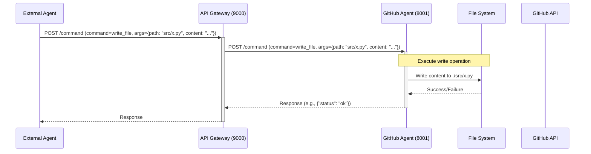
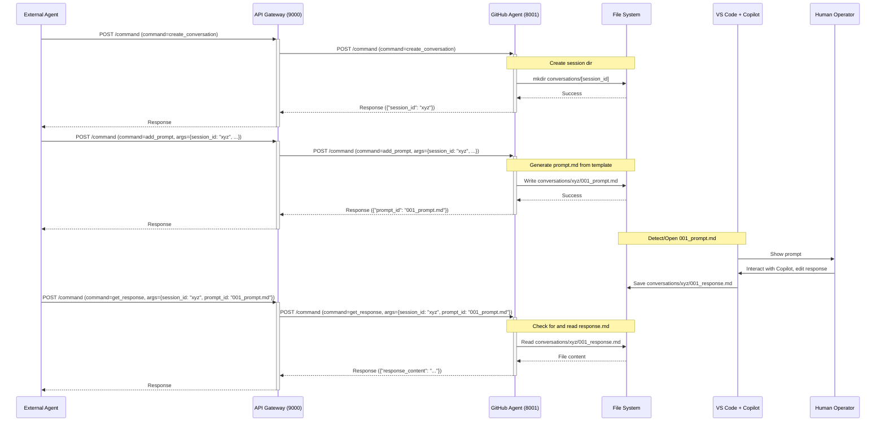
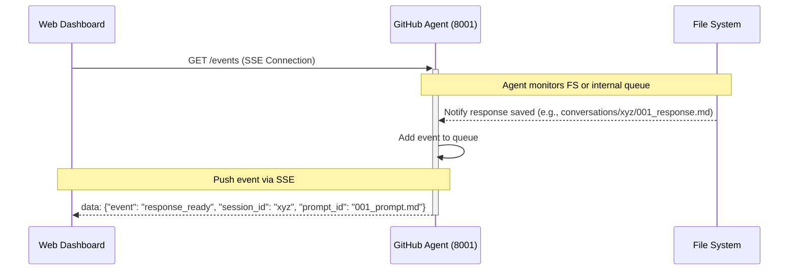

# Architecture Overview: AI Agent System Prototype

## 1. System Components

The prototype consists of the following key components:

1.  **External AI System(s):** (e.g., GPT-based agents, specialized tools) - Interact with the system via the API Gateway.
2.  **API Gateway:** (Port 9000) - Public-facing entry point. Handles request translation (schema mapping) and forwards requests to the appropriate internal agent (initially, only the GitHub Agent).
3.  **GitHub Agent:** (Port 8001) - Core service responsible for interacting with the GitHub repository, managing the file system (including conversation documents), and orchestrating the Copilot handoff workflow.
4.  **Document Store (File System):** - Uses the local file system (`conversations/`, `docs/`, project source) to store state, prompts, responses, and plans.
5.  **VS Code + GitHub Copilot:** - The environment where prompt documents are opened, Copilot interaction occurs, and response documents are saved (manual or semi-automated step).
6.  **Web Dashboard:** (Served by GitHub Agent or a separate UI service) - Provides monitoring and potentially interaction capabilities.

## 2. Architecture Style

-   **Microservices-like:** Although simple initially, the Gateway and GitHub Agent are distinct services, allowing for independent scaling and development.
-   **API-Driven:** Interactions between components primarily occur via RESTful APIs.
-   **Document-Based Workflow:** The core logic for Copilot integration revolves around creating, sharing, and monitoring structured markdown documents on the file system.
-   **Event-Driven (Optional):** Potential for incorporating Server-Sent Events (SSE) for real-time updates from the GitHub Agent to the Dashboard or other subscribed clients.

## 3. Data Flow and Interactions

### Standard Command Flow (e.g., Write File)

### Copilot Handoff Workflow (Prompt Generation & Response Retrieval)

### Event Notification Flow (Optional)

## 4. Service Boundaries & Responsibilities

-   **API Gateway:**
    -   Expose public API.
    -   Schema translation.
    -   Request routing to internal agents.
    -   (Future) Authentication/Authorization.
-   **GitHub Agent:**
    -   Implement core business logic for file operations, Git actions, PR creation.
    -   Manage the `conversations/` directory structure.
    -   Generate prompt documents and parse response documents.
    -   Interact with GitHub API.
    -   Serve the dashboard UI (or provide API for it).
    -   (Optional) Publish events via SSE.
-   **Document Store (File System):**
    -   Persist conversation state (prompts, responses).
    -   Store generated plans/documentation.
    -   Provide the shared medium for Copilot handoff.
-   **VS Code + Copilot:**
    -   Provide the UI/environment for human interaction with Copilot based on generated prompts.
    -   Save Copilot suggestions into response documents.

## 5. Protocols

-   **HTTP/REST:** For communication between External Agents, Gateway, and GitHub Agent.
-   **File System I/O:** For managing conversation documents and project files.
-   **HTTPS:** For communication with the GitHub API.
-   **SSE (Server-Sent Events):** (Optional) For real-time updates from GitHub Agent to clients like the dashboard.
